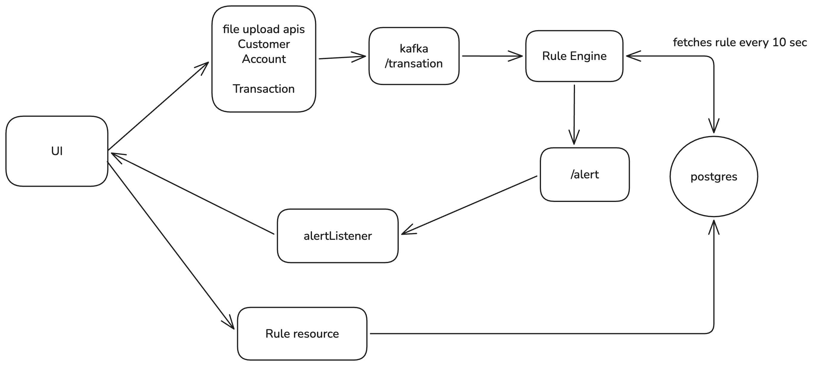
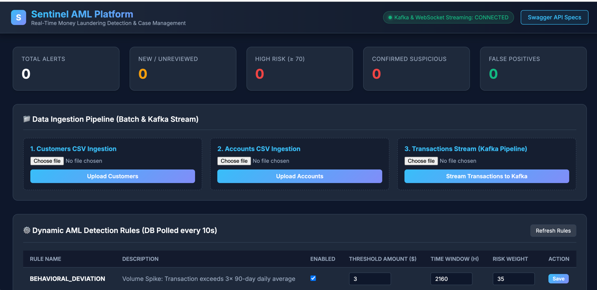
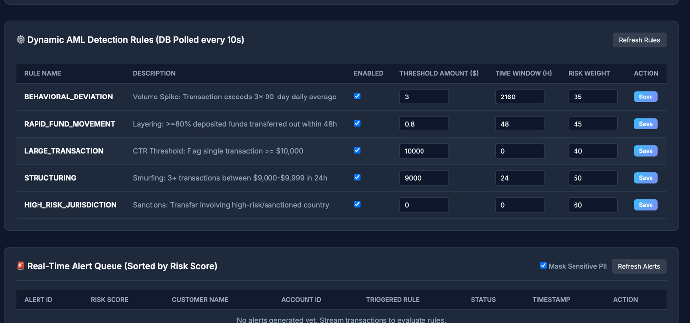
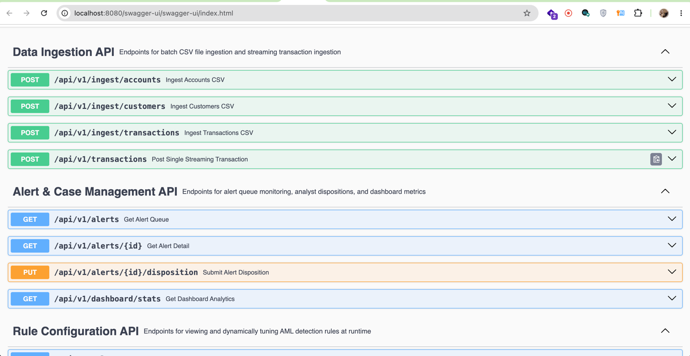
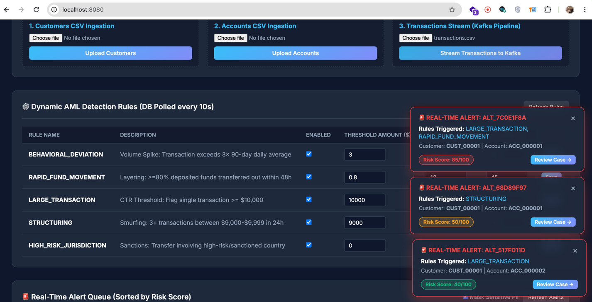

# Sentinel AML: Low-Level Architecture & Hands-On Simulation Guide

---

## 1. What is Sentinel AML and Why Does it Exist?

### The Problem
Banks handle millions of money transfers daily. Criminals attempt to disguise illegal funds (drug money, tax evasion, fraud) as legitimate money through **Money Laundering**. Compliance regulations require banks to catch suspicious transfers in real time. Standard batch reporting takes 48–72 hours—by which time illegal funds have already left the bank.

### The Solution: Sentinel AML
**Sentinel AML** is a real-time money laundering detection system built on Spring Boot, PostgreSQL, Apache Kafka, and WebSockets. It constantly monitors financial transactions, runs them against configurable rules, generates risk-scored alerts, and instantly pops up alerts on a compliance analyst's screen via WebSockets.

---

## 2. Low-Level System Architecture & Component Box Diagram

### End-to-End Data Flow Diagram (Mermaid)



---

### Detailed Service Box Descriptions

| Box / Component | Responsibilities & Functions |
| :--- | :--- |
| **`IngestionController` & `CsvIngestionService`** | Parses `customers.csv`, `accounts.csv`, and `transactions.csv`. Saves entities to PostgreSQL and pushes transactions into the Kafka stream. |
| **`TransactionProducer` & `transactions` Kafka Topic** | Decouples transaction ingestion from detection logic. Ensures high throughput and asynchronous streaming. |
| **`TransactionConsumer`** | Asynchronously reads transactions from Kafka as fast as they arrive and passes them to the detection engine. |
| **`RuleConfigCacheService` (10s Polling Singleton)** | A singleton Spring service with a `@Scheduled(fixedRate = 10000)` thread. Every 10 seconds, it queries PostgreSQL table `rule_configs` and updates an in-memory `ConcurrentHashMap`. This allows rule changes made in the UI to take effect live without restarting the server. |
| **`DetectionEngineService`** | The brain of the platform. Evaluates incoming transactions against the active rules in `RuleConfigCacheService`. Calculates a 0–100 risk score, creates an `Alert` entity, saves it to PostgreSQL, and forwards it to the `AlertProducer`. |
| **`AlertProducer` & `alerts` Kafka Topic** | Publishes generated alerts to Kafka so downstream notification services (WebSockets, email, audit loggers) can consume them independently. |
| **`AlertWebSocketListener` & STOMP Broker** | Listens to the `alerts` Kafka topic and broadcasts alert payloads over WebSockets (`/topic/alerts`) to connected browser clients. |
| **`index.html` UI & Corner Popup Toasts** | Web dashboard receiving STOMP WebSocket messages. Displays real-time alert count cards, dynamic rule tuning controls, and floating bottom-right popup cards. |

---

## 3. Understanding AML Rule Parameters (What and Why)

Compliance officers can tune 3 key parameters for each AML detection rule dynamically from the UI or Swagger:

```
+-----------------------------------------------------------------------------------+
|  Rule Configuration Parameters                                                   |
+-----------------------------------------------------------------------------------+
| 1. Threshold Amount ($)  ---> Minimum dollar amount required to trigger the rule |
| 2. Time Window (hours)   ---> Historical lookback window for pattern evaluation   |
| 3. Risk Weight (0-100)   ---> Impact score added to the total alert risk score    |
+-----------------------------------------------------------------------------------+
```

### A) Threshold Amount ($)
- **What it is:** The minimum dollar value a transaction (or total accumulated transactions) must reach to trigger a rule.
- **Why it exists:** Regulatory laws require banks to report transfers above specific amounts. For example:
  - **Large Transaction (CTR Rule):** Law requires reporting any transfer $\ge \$10,000$.
  - **Structuring (Smurfing Rule):** Criminals deliberately break $\$30,000$ into 3 deposits of $\$9,500$ to stay under the $\$10,000$ threshold. Setting a threshold range of $\$9,000 - \$9,999$ catches this tactic.

### B) Time Window (hours)
- **What it is:** How far back in time (in hours) the engine looks to evaluate past transactions for the same account.
- **Why it exists:** Laundering patterns occur across multiple transfers:
  - **Structuring (24-hour window):** 3 transactions of $\$9,500$ within 24 hours indicate smurfing.
  - **Rapid Movement of Funds (48-hour window):** Depositing $\$50,000$ and withdrawing $\$45,000$ (90%) within 48 hours indicates money laundering layering.

### C) Risk Weight (0 - 100)
- **What it is:** The severity score assigned when a rule is triggered.
- **Why it exists:** Not all suspicious activities carry equal severity:
  - Transfers to sanctioned countries (e.g., Iran, North Korea) carry a **High Risk Weight (60)**.
  - A minor volume deviation carries a **Medium Risk Weight (35)**.
  - When multiple rules trigger for the same transaction, their risk weights accumulate (capped at 100) so analysts can sort high-priority alerts to the top.

---

## 4. Step-by-Step Guide: How to Simulate and Test Rule Tuning Live

Follow these simple steps to demonstrate real-time transaction streaming and dynamic rule changes.

### Step 1: Start System Infrastructure
1. Start PostgreSQL & Kafka containers:
   ```bash
   docker-compose up -d
   ```
2. Launch the Spring Boot application:
   ```bash
   ./mvnw spring-boot:run
   ```
3. Open the Web Dashboard in your browser:
   ```
   http://localhost:8080
   ```

---

### Step 2: Seed Customer & Account Baseline Data
1. Under **📁 Data Ingestion Pipeline**:
   - Click **Choose File** for **1. Customers CSV Ingestion** and select [`customers.csv`](file:///Users/kloudspot/Kloudspot/sample_spring_boot_app/customers.csv). Click **Upload Customers**.
   - Click **Choose File** for **2. Accounts CSV Ingestion** and select [`accounts.csv`](file:///Users/kloudspot/Kloudspot/sample_spring_boot_app/accounts.csv). Click **Upload Accounts**.

---

### Step 3: Stream Initial Transactions CSV
1. Select [`transactions.csv`](file:///Users/kloudspot/Kloudspot/sample_spring_boot_app/transactions.csv) under **3. Transactions Stream (Kafka Pipeline)** and click **Stream Transactions to Kafka**.
2. **Observe:**
   - Real-time popup notifications immediately slide in at the **bottom-right corner** of the screen!
   - High-risk alerts populate the **Real-Time Alert Queue** table.

---

### Step 4: Simulate Runtime Rule Tuning (No Server Restart Required)

Now let's test lowering the threshold for **`LARGE_TRANSACTION`** from $\$10,000$ to $\$4,000$:

1. In the **⚙️ Dynamic AML Detection Rules** table on the UI:
   - Find **`LARGE_TRANSACTION`**.
   - Change **Threshold Amount ($)** from `10000.00` to `4000.00`.
   - Click **Save**.
2. **Wait 10 Seconds:** The backend `RuleConfigCacheService` automatically polls PostgreSQL and reloads the updated rule parameter.
3. Stream [`transactions.csv`](file:///Users/kloudspot/Kloudspot/sample_spring_boot_app/transactions.csv) again.
4. **Observe the Result:**
   - Previously ignored transactions (e.g. `TXN_100007` for $\$4,500$) now trigger a **`LARGE_TRANSACTION`** alert because $\$4,500 \ge \$4,000$!
   - A new alert popup appears in the bottom-right corner immediately over WebSockets.

---

## 5. Summary Table of Core Detection Rules

| Rule Name | Typology Description | Default Threshold | Default Window | Default Risk Weight |
| :--- | :--- | :--- | :--- | :--- |
| **`LARGE_TRANSACTION`** | Flag single high-value transaction (CTR) | $\ge \$10,000.00$ | 0h | 40 |
| **`STRUCTURING`** | Flag smurfing (multiple transfers just under limit) | $\$9,000 - \$9,999$ | 24h | 50 |
| **`RAPID_FUND_MOVEMENT`** | Flag layering ($\ge 80\%$ funds exiting shortly after deposit) | $\ge 80\%$ exit | 48h | 45 |
| **`HIGH_RISK_JURISDICTION`** | Flag transfer to/from sanctioned countries | Country Watchlist | 0h | 60 |
| **`BEHAVIORAL_DEVIATION`** | Flag volume spike exceeding historical baseline | $> 3\times$ avg balance | 90 days | 35 |

## 6. Ui screen shorts


